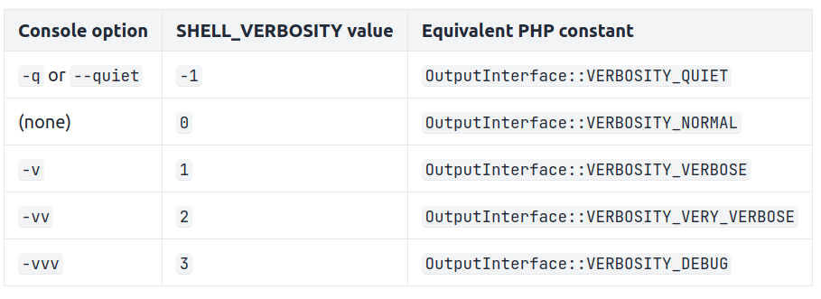

# Console

## Built-in commands

* default command is `list` (`php bin/console list` = `php bin/console`)
* `completion` to dump the shell completion script
* `about` to display infos about the current project
* `help` to display help for a command

### Cache Commands

* `cache:clear`                 Clear the cache
* `cache:pool:clear`            Clear cache pools
* `cache:pool:delete`           Delete an item from a cache pool
* `cache:pool:invalidate-tags`  Invalidate cache tags for all or a specific pool`
* `cache:pool:list`             List available cache pools
* `cache:pool:prune`            Prune cache pools
* `cache:warmup`                Warm up an empty cache

### Debug Commands

* `debug:autowiring`            List classes/interfaces you can use for autowiring
* `debug:config`                Dump the current configuration for an extension
* `debug:container`             Display current services for an application
* `debug:dotenv`                List all dotenv files with variables and values
* `debug:event-dispatcher`      Display configured listeners for an application
* `debug:router`                Display current routes for an application
* `debug:twig`                  Show a list of twig functions, filters, globals and tests

### Lint Commands

* `lint:container`              Ensure that arguments injected into services match type declarations
* `lint:twig`                   Lint a Twig template and outputs encountered errors
* `lint:yaml`                   Lint a YAML file and outputs encountered errors

### Secrets Commands

* `secrets:decrypt-to-local`    Decrypt all secrets and stores them in the local vault
* `secrets:encrypt-from-local`  Encrypt all local secrets to the vault
* `secrets:generate-keys`       Generate new encryption keys
* `secrets:list`                List all secrets
* `secrets:remove`              Remove a secret from the vault
* `secrets:set`                 Set a secret in the vault

## Custom commands

* To create a command, our class have to extend [Command](https://github.com/symfony/symfony/blob/7.0/src/Symfony/Component/Console/Command/Command.php) class.
* The #[AsCommand] attribute allows to define `name`, `aliases`, `hidden` and `description` option. Setting a descritpion from the attribute instead of using setDescription() method allows to get the description of the command without instantiating the class (much faster, like using the `--short` to the `list` command)
```php
// src/Command/CreateUserCommand.php
namespace App\Command;

use Symfony\Component\Console\Attribute\AsCommand;
use Symfony\Component\Console\Command\Command;
use Symfony\Component\Console\Input\InputInterface;
use Symfony\Component\Console\Output\OutputInterface;

// the name of the command is what users type after "php bin/console"
#[AsCommand(name: 'app:create-user')]
class CreateUserCommand extends Command
{
    protected function execute(InputInterface $input, OutputInterface $output): int
    {
        // ... put here the code to create the user

        // this method must return an integer number with the "exit status code"
        // of the command. You can also use these constants to make code more readable

        // return this if there was no problem running the command
        // (it's equivalent to returning int(0))
        return Command::SUCCESS;

        // or return this if some error happened during the execution
        // (it's equivalent to returning int(1))
        // return Command::FAILURE;

        // or return this to indicate incorrect command usage; e.g. invalid options
        // or missing arguments (it's equivalent to returning int(2))
        // return Command::INVALID
    }
}
```

Here are the three methods that are invoked (in that order) when running the command :
1. [initialize()](https://github.com/symfony/symfony/blob/7.0/src/Symfony/Component/Console/Command/Command.php#:~:text=function%20initialize)(optional): initailize variables used in other commands methods
2. [interact()](https://github.com/symfony/symfony/blob/7.0/src/Symfony/Component/Console/Command/Command.php#:~:text=function%20interact)(optional): check if options/arguments are missing and asks user for those values. not called if command is running with `--no-interaction` option flag
3. [execute()](https://github.com/symfony/symfony/blob/7.0/src/Symfony/Component/Console/Command/Command.php#:~:text=function%20execute)(required): performs our logic and must return an integer used as [exit status](https://en.wikipedia.org/wiki/Exit_status)

## Configuration

* Configuration is defined in the `configure()` method, which is run immediately after the parent constructor. (If you're definig your own constructor and not using constructor property promotion, you have to set your properties before calling the parent constructor)
* In this method, you can define a description, help message, input options and arguments.

## Options and arguments

### Arguments

* Arguments can be added with the addArgument() method whose signature is :
```php
public function addArgument(string $name, int $mode = null, string $description = '', mixed $default = null, array|\Closure $suggestedValues = []): static
```
* There are three arguments variants, and IS_ARRAY can be combined with the one of the others:
    - `InputArgument::REQUIRED`
    - `InputArgument::OPTIONAL`
    - `InputArgument::IS_ARRAY` (must be used at the end of the list)
```php
$this
    // ...
    ->addArgument(
        'names',
        InputArgument::IS_ARRAY | InputArgument::REQUIRED,
        'Who do you want to greet (separate multiple names with a space)?'
    )
;
```

### Options

* Options are not ordered, and specified with two dashes (e.g. `--yell`) or with a shortcut (`-y`).
* Options are defined with the `addOption()` method :
```php
// ...
use Symfony\Component\Console\Input\InputOption;

$this
    // ...
    ->addOption(
        // this is the name that users must type to pass this option (e.g. --iterations=5)
        'iterations',
        // this is the optional shortcut of the option name, which usually is just a letter
        // (e.g. `i`, so users pass it as `-i`); use it for commonly used options
        // or options with long names
        null,
        // this is the type of option (e.g. requires a value, can be passed more than once, etc.)
        InputOption::VALUE_REQUIRED,
        // the option description displayed when showing the command help
        'How many times should the message be printed?',
        // the default value of the option (for those which allow to pass values)
        1
    )
;
```
* To comply with [docopt standard](http://docopt.org/), long options (`--iterations`) can specify their value with a whitespace or an `=` sign, whereas short option (`-i`) can only use whitespace or no separation.
* There are five options variants :
    - `InputOption::VALUE_IS_ARRAY`
    - `InputOption::VALUE_NONE` : Do not accept input for this option (e.g. --yell). The value returned from is a boolean (false if the option is not provided). This is the default behavior of options;
    - `InputOption::VALUE_REQUIRED`
    - `InputOption::VALUE_OPTIONAL` : This option may or may not have a value (e.g. --yell or --yell=loud).
    - `InputOption::VALUE_NEGATABLE` : Accept either the flag (e.g. --yell) or its negation (e.g. --no-yell).
* You can use completion value as last argument of addArgument() or addOption() method :
```php
// ...
use Symfony\Component\Console\Completion\CompletionInput;
use Symfony\Component\Console\Completion\CompletionSuggestions;

class GreetCommand extends Command
{
    // ...
    protected function configure(): void
    {
        $this
            ->addArgument(
                'names',
                InputArgument::IS_ARRAY,
                'Who do you want to greet (separate multiple names with a space)?',
                null,
                function (CompletionInput $input): array {
                    // the value the user already typed, e.g. when typing "app:greet Fa" before
                    // pressing Tab, this will contain "Fa"
                    $currentValue = $input->getCompletionValue();

                    // get the list of username names from somewhere (e.g. the database)
                    // you may use $currentValue to filter down the names
                    $availableUsernames = ...;

                    // then suggested the usernames as values
                    return $availableUsernames;
                }
            )
        ;
    }
}
```

### Predefined Options

* `--verbose`: sets the verbosity level (e.g. 1 the default, 2 and 3, or you can use respective shortcuts -v, -vv and -vvv)
* `--quiet`: disables output and interaction
* `--no-interaction`: disables interaction
* `--version`: outputs the version number of the console application
* `--help`: displays the command help
* `--ansi|--no-ansi`: whether to force of disable coloring the output
When using the FrameworkBundle, two more options are predefined:
* `--env`: sets the Kernel configuration environment (defaults to APP_ENV)
* `--no-debug`: disables Kernel debug (defaults to APP_DEBUG)

You can also add the `--profile` flag (if debug mode and profiler are enbaled) to have access to that profile through the web page of the profiler. Using `-v` option, you'll get a clickable link to the command profile.

## Input and Output objects

* The `execute()` method takes an input object and an output object as parameters.
* input object => see [InputInterface](https://github.com/symfony/symfony/blob/7.1/src/Symfony/Component/Console/Input/InputInterface.php). Provides some helpers (e.g. getArgument())
* output object => see [OutputInterface](https://github.com/symfony/symfony/blob/7.1/src/Symfony/Component/Console/Output/OutputInterface.php)
```php
// ...
protected function execute(InputInterface $input, OutputInterface $output): int
{
    // outputs multiple lines to the console (adding "\n" at the end of each line)
    $output->writeln([
        'User Creator',
        '============',
        '',
    ]);

    // the value returned by someMethod() can be an iterator (https://php.net/iterator)
    // that generates and returns the messages with the 'yield' PHP keyword
    $output->writeln($this->someMethod());

    // outputs a message followed by a "\n"
    $output->writeln('Whoa!');

    // outputs a message without adding a "\n" at the end of the line
    $output->write('You are about to ');
    $output->write('create a user.');

    return Command::SUCCESS;
}
```

### Output Sections

* Output sections let us manipulate the Console outputs in advanced ways (multiple progress bars or append rows to tables). They are created with the `section()` method.
```php
// ...
use Symfony\Component\Console\Output\ConsoleOutputInterface;

class MyCommand extends Command
{
    protected function execute(InputInterface $input, OutputInterface $output): int
    {
        if (!$output instanceof ConsoleOutputInterface) {
            throw new \LogicException('This command accepts only an instance of "ConsoleOutputInterface".');
        }

        $section1 = $output->section();
        $section2 = $output->section();

        $section1->writeln('Hello');
        $section2->writeln('World!');
        sleep(1);
        // Output displays "Hello\nWorld!\n"

        // overwrite() replaces all the existing section contents with the given content
        $section1->overwrite('Goodbye');
        sleep(1);
        // Output now displays "Goodbye\nWorld!\n"

        // clear() deletes all the section contents...
        $section2->clear();
        sleep(1);
        // Output now displays "Goodbye\n"

        // ...but you can also delete a given number of lines
        // (this example deletes the last two lines of the section)
        $section1->clear(2);
        sleep(1);
        // Output is now completely empty!

        // setting the max height of a section will make new lines replace the old ones
        $section1->setMaxHeight(2);
        $section1->writeln('Line1');
        $section1->writeln('Line2');
        $section1->writeln('Line3');

        return Command::SUCCESS;
    }
}
```

## Built-in helpers

* [Formatter Helper](https://symfony.com/doc/current/components/console/helpers/formatterhelper.html): The Formatter helper provides functions to format the output with colors. Included in the default helper (can be called with:<br> `$formatter = $this->getHelper('formatter');`)
* [Process Helper](https://symfony.com/doc/current/components/console/helpers/processhelper.html): The Process Helper shows processes as they're running and reports useful information about process status. Included in the default helper.
* [Progress Bar](https://symfony.com/doc/current/components/console/helpers/progressbar.html)
* [Question Helper](https://symfony.com/doc/current/components/console/helpers/questionhelper.html): The QuestionHelper provides functions to ask the user for more information. Included in the default helper.
* [Table](https://symfony.com/doc/current/components/console/helpers/table.html)
* [Debug Formatter Helper](https://symfony.com/doc/current/components/console/helpers/debug_formatter.html): Included in the default helper
* [Cursor Helper](https://symfony.com/doc/current/components/console/helpers/cursor.html): The Cursor allows you to change the cursor position in a console command.

## Console events

* Commands called by the main command will not trigger events.
* `ConsoleEvents::COMMAND`: Doing something before any command is run (like logging which command is going to be executed), or displaying something about the event to be executed. If you disable a command from inside the listener it will return code 113 (`ConsoleCommandEvent::RETURN_CODE_DISABLED`).
* `ConsoleEvents::ERROR`: Handle exceptions thrown during the execution of a command.
* `ConsoleEvents::TERMINATE`: To perform some cleanup actions after the command has been executed.
* `ConsoleEvents::SIGNAL`: To perform some actions after the command execution was interrupted. (e.g. using `Ctrl + C`).

## Verbosity levels



