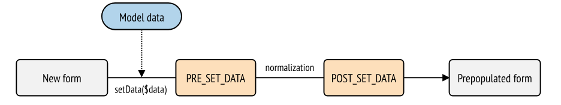
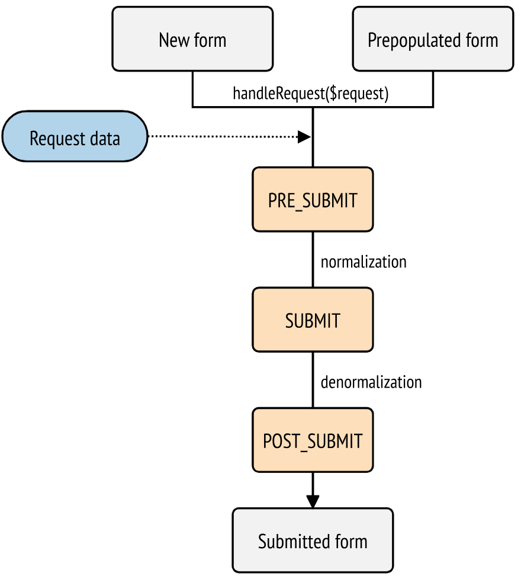

# Forms

## Form Creation

In Symfony, FormType refers both to :
- an entire form
- a specific form field (like an input field)
- a group of form fields

There are two main ways to create forms :
1. Inside a Controller
Using the `createFormBuilder()` method (defined in AbstractController) :
```php
// src/Controller/TaskController.php
namespace App\Controller;

use App\Entity\Task;
use Symfony\Bundle\FrameworkBundle\Controller\AbstractController;
use Symfony\Component\Form\Extension\Core\Type\DateType;
use Symfony\Component\Form\Extension\Core\Type\SubmitType;
use Symfony\Component\Form\Extension\Core\Type\TextType;
use Symfony\Component\HttpFoundation\Request;
use Symfony\Component\HttpFoundation\Response;

class TaskController extends AbstractController
{
    public function new(Request $request): Response
    {
        // creates a task object and initializes some data for this example
        $task = new Task();
        $task->setTask('Write a blog post');
        $task->setDueDate(new \DateTimeImmutable('tomorrow'));

        $form = $this->createFormBuilder($task)
            ->add('task', TextType::class)
            ->add('dueDate', DateType::class)
            ->add('save', SubmitType::class, ['label' => 'Create Task'])
            ->getForm();

        // ...
    }
}
```

2. In a FormType class which extends [AbstractType](https://github.com/symfony/symfony/blob/7.0/src/Symfony/Component/Form/AbstractType.php) (Recommended way in order to put as little logic as possible inside controllers). 
```php
   // src/Form/Type/TaskType.php
namespace App\Form\Type;

use Symfony\Component\Form\AbstractType;
use Symfony\Component\Form\Extension\Core\Type\DateType;
use Symfony\Component\Form\Extension\Core\Type\SubmitType;
use Symfony\Component\Form\Extension\Core\Type\TextType;
use Symfony\Component\Form\FormBuilderInterface;

class TaskType extends AbstractType
{
    public function buildForm(FormBuilderInterface $builder, array $options): void
    {
        $builder
            ->add('task', TextType::class)
            ->add('dueDate', DateType::class)
            ->add('save', SubmitType::class)
        ;
    }
}
```
Then it can be used inside the controller using the `createForm()` method which takes the FormType class as first argument (or the `create()` method of the `form.factory` service).

Maker bundle can generate form classes using `make:form` or `make:registration-form` commands.

Even if it's not necessary, it's better to specify the name of the class that holds data from the form (necessary for embedded forms) inside the `configurationOptions()` method :
```php
public function configureOptions(OptionsResolver $resolver): void
    {
        $resolver->setDefaults([
            'data_class' => Task::class,
        ]);
    }
```

## Form handling

Symfony recommends to use a single action to render and process the form.
With the condition `if ($form->isSubmitted() && $form->isValid())` there are three possibilities :
1. the form has not been submitted so it's just rendered
2. the form is submitted but not valid : rendered with validation errors
3. form is submitted and valid : we can perform actions on the object that holds the data

* Redirect a user after form submission is the best practice to prevent him from re-post datas
* `submit()` method offers more control on the submitted data (i.e. making a PATCH request, by passing false as second argument. Otherwise the other fields not submitted will be set to null). [Details](https://symfony.com/doc/current/form/direct_submit.html)
* When submitting a form via a "PATCH" request, you may want to update only a few submitted fields. To achieve this, you may pass an optional second boolean argument to submit(). Passing false will remove any missing fields within the form object. Otherwise, the missing fields will be set to null.

### Form Validation

* Validation is made on the object after submitted data has been applied to it. So the validation is based on the Entity properties
* Validation rules can be added on the form (or each field) with the `constraints` option.

## Form types

### Built-in

See [docs](https://symfony.com/doc/current/reference/forms/types.html) to have complete list and details for buil-in FormType

### Custom FormType

* Custom FormType also extends AbstractType. If not build from scratch, we can use `getParent()` method and so Symfony will call all the form type methods (buildForm(), buildView(), etc.) and type extensions of the parent before calling the ones defined in your custom type.
* most important methods :
- `configureOptions()`
- `buildForm()` : same in symfony form classes
- `buildView()` : set extra variables to render the field in template
- `finishView()` : allow accessing child views with $view['child_name'] (use `buildView()` when that's not necessary)

Here is how to define custom options in our form type : 
```php
// src/Form/Type/PostalAddressType.php
namespace App\Form\Type;

use Symfony\Component\Form\AbstractType;
use Symfony\Component\Form\Extension\Core\Type\TextType;
use Symfony\Component\OptionsResolver\Options;
use Symfony\Component\OptionsResolver\OptionsResolver;

class PostalAddressType extends AbstractType
{
    // ...

    public function configureOptions(OptionsResolver $resolver): void
    {
        // this defines the available options and their default values when
        // they are not configured explicitly when using the form type
        $resolver->setDefaults([
            'allowed_states' => null,
            'is_extended_address' => false,
        ]);

        // optionally you can also restrict the options type or types (to get
        // automatic type validation and useful error messages for end users)
        $resolver->setAllowedTypes('allowed_states', ['null', 'string', 'array']);
        $resolver->setAllowedTypes('is_extended_address', 'bool');

        // optionally you can transform the given values for the options to
        // simplify the further processing of those options
        $resolver->setNormalizer('allowed_states', static function (Options $options, $states): ?array
        {
            if (null === $states) {
                return $states;
            }

            if (is_string($states)) {
                $states = (array) $states;
            }

            return array_combine(array_values($states), array_values($states));
        });
    }
}
```

* There are some naming rules to respect so as the form to be rendered with our custom theme (see [form_theme section](#form_theme))
* Example of passing var to custom form_theme :
```php
public function buildView(FormView $view, FormInterface $form, array $options): void
    {
        // pass the form type option directly to the template
        $view->vars['isExtendedAddress'] = $options['is_extended_address'];

        // make a database query to find possible notifications related to postal addresses (e.g. to
        // display dynamic messages such as 'Delivery to XX and YY states will be added next week!')
        $view->vars['notification'] = $this->entityManager->find('...');
    }
```

## Form Rendering

* `form()` twig function is enough to render all the form
* `form_row(form.username)` is the same as :
```php
{{ form_label(form.username) }}
{{ form_widget(form.username) }}
{{ form_errors(form.username) }}
{{ form_help(form.username) }}
```
* Whenusing `form_start()` / `form_end()` syntax we can use `form_rest()` to render all the fields not explicitly included in our block (including the hidden one for csrf token protection)
* the form_* functions can be replaced by some field functions so that the html can be fully customizable (and must be written) :
```jinja
<input
    name="{{ field_name(form.username) }}"
    value="{{ field_value(form.username) }}"
    placeholder="{{ field_label(form.username) }}"
    class="form-control"
>

<select name="{{ field_name(form.country) }}" class="form-control">
    <option value="">{{ field_label(form.country) }}</option>

    
        <option value="{{ value }}">{{ label }}</option>
    
</select>
```

* If you're rendering an entire form at once (or an entire embedded form), the variables argument will only be applied to the form itself and not its children. In other words, the following will not pass a "foo" class attribute to all of the child fields in the form:
```php
{# does **not** work - the variables are not recursive #}
{{ form_widget(form, { 'attr': {'class': 'foo'} }) }}
```
To do so, you have to iterate with a for loop on form.children
* You can access a bunch of useful variables with `form.name.vars` where `name` is the name of the field ([full list](https://symfony.com/doc/current/form/form_customization.html#form-variables-reference))

## form_theme

* Form themes are globally defined in config file 
```php
# config/packages/twig.yaml
twig:
    form_themes: ['bootstrap_5_horizontal_layout.html.twig']
    # ...
```
(default template is 'form_div_layout.html.twig')

The last form theme defined in this array will override the others, so the order is important
* They can also be defined directly in the template :
- applying a single theme on a form :
```php
{# this form theme will be applied only to the form of this template #}


{{ form_start(form) }}
    {# ... #}
{{ form_end(form) }}
```

- applying multiple themes on a form :
```php
{# apply multiple form themes but only to the form of this template #}


{# ... #}
```

**form theme globally defined are always applied, even when using `form_theme` twig tag**

To disable them use the `only` keyword :
```php


{# ... #}
```
Using `only`, as all form themes have been disabled, we have to provide a fully featured form theme, or use the `use` tag to re-apply one when needed :
```php
{# templates/form/common.html.twig #}


{# ... #}
```

### Form Fragment Naming

* If you want to customize all fields of the same type (e.g. all textarea elements) use the field-type_field-part pattern (e.g. textarea_widget).
* If you want to customize only one specific field (e.g. the textarea elements used for the description field of the form that edits products) use the _field-id_field-part pattern (e.g. _product_description_widget).

(where field-part van be label, widget, row, errors or help)

* These fragment names follow the _id_part pattern, where the id corresponds to the field id attribute (e.g. product_description, user_age, etc) and the part corresponds to what is being rendered (e.g. label, widget, etc.)
The id attribute contains both the form name and the field name (e.g. product_price). The form name can be set manually or generated automatically based on your form type name (e.g. ProductType equates to product). This value can be defined explicitly with the `block_name` option.
* The `block_prefix` option allows form fields to define their own custom fragment name. This is mostly useful to customize some instances of the same field without having to create a custom form type

[Examples](https://symfony.com/doc/current/form/form_themes.html#creating-your-own-form-theme)

* To override some specific blocks for a specific form you have to use the tag `` It only works if your template extends another one. Otherwise you'll have to create a separate template and override the specific block you target (e.g. ``).

## CSRF Protection

As token are stored in a session, you can't cache a page that contains a form which uses csrf protection, except embedding the form in an ESI fragment or loading the form with an AJAX request

* In Symfony Forms, csrf protection is enabled automatically, so you don't have to worry about. If you need to generate a csrf token in your template, use `csrf_token()` twig function and the `isCsrfTokenValid()` method in your controller (taking as parameter the key you passed to the twig function used to generate the token).

## Handling File Upload

[See that section](Controllers.md#file-upload)

## Data Transformers

* Data transformers are used to translate the data for a field into a format that can be displayed in a form (and back on submit). They're already used internally for many field types. For example, the DateType field can be rendered as a yyyy-MM-dd-formatted input text box. Internally, a data transformer converts the DateTime value of the field to a yyyy-MM-dd formatted string when rendering the form, and then back to a DateTime object on submit.
* You have to use the `addModelTransformer()` method on the builder to apply a data transformer on your form. ([Full example](https://symfony.com/doc/current/form/data_transformers.html#about-model-and-view-transformers))
* `inherit_data` is a form option that allows Symfony to populate an embedded formtype with corresponding properties from the entity mapped by the parent form ([Example](https://symfony.com/doc/current/form/inherit_data_option.html)). If set to true, data transformers won't be applied to this field/form.

### Difference between data mappers and data transformers

* Data transformers change the representation of a single value, e.g. from "2016-08-12" to a DateTime instance;
* Data mappers map data (e.g. an object or array) to one or many form fields, and vice versa, e.g. using a single DateTime instance to populate the inner fields (e.g year, hour, etc.) of a compound date type.

## Form Events

[Form Workflow](https://symfony.com/doc/current/form/events.html)

|Name	|FormEvents Constant|	Event's Data|
|-------|-------------------|---------------|
|form.pre_set_data|	FormEvents::PRE_SET_DATA|	Model data|
|form.post_set_data|	FormEvents::POST_SET_DATA|	Model data|
|form.pre_submit|	FormEvents::PRE_SUBMIT|	Request data|
|form.submit|	FormEvents::SUBMIT|	Normalized data|
|form.post_submit|	FormEvents::POST_SUBMIT|	View data|

### Pre-populating the Form (FormEvents::PRE_SET_DATA and FormEvents::POST_SET_DATA)



#### FormEvents::PRE_SET_DATA

* The FormEvents::PRE_SET_DATA event is dispatched at the beginning of the Form::setData() method. Form::setData() is locked and it will throw an exception if this method is called from a listener.
* In the context of the Form component, Symfony subscribes to this event in order to reorder the form's fields depending on the data from the pre-populated object, by removing and adding all form rows.

#### FormEvents::POST_SET_DATA

* The FormEvents::POST_SET_DATA event is dispatched at the end of the Form::setData() method.
* In the context of the Form component, Symfony subscribes to this event in order to collect information about the forms from the denormalized model and view data.

### Submitting a Form (FormEvents::PRE_SUBMIT, FormEvents::SUBMIT and FormEvents::POST_SUBMIT)



#### The FormEvents::PRE_SUBMIT Event

* The FormEvents::PRE_SUBMIT event is dispatched at the beginning of the Form::submit() method.
* In the context of the Form component, Symfony subscribes to this event in order to validate the CSRF token.

#### The FormEvents::SUBMIT Event

* The FormEvents::SUBMIT event is dispatched right before the Form::submit() method transforms back the normalized data to the model and view data.
* In the context of the Form component, Symfony subscribes to this event in order to prepend a default protocol to URL fields that were submitted without a protocol.

#### The FormEvents::POST_SUBMIT Event

* The FormEvents::POST_SUBMIT event is dispatched after the Form::submit() once the model and view data have been denormalized.
* In the context of the Form component, Symfony subscribes to this event in order to automatically validate the denormalized object.

## Form Type Extension

* Your extension must extend [AbstractTypeExtension](https://github.com/symfony/symfony/blob/7.0/src/Symfony/Component/Form/AbstractTypeExtension.php) or implements [FormTypeExtensionInterface](https://github.com/symfony/symfony/blob/7.0/src/Symfony/Component/Form/FormTypeExtensionInterface.php)
* The only method you must implement is getExtendedTypes(), which returns an array of the field types you want to modify.
* a form type extension applying to FormType would apply to most of the form types (notable exceptions are the ButtonType form types)
* A form type extension applying to a "parent" form type will apply to all the other form types that are extensions (those whose getExtendedTypes() return the "parent" form type) of this "parent" form type:<br>
E.g. several form types inherit from the TextType form type (such as EmailType, SearchType, UrlType, etc.). A form type extension applying to TextType (i.e. whose getExtendedType() method returns TextType::class) would apply to all of these form types.


