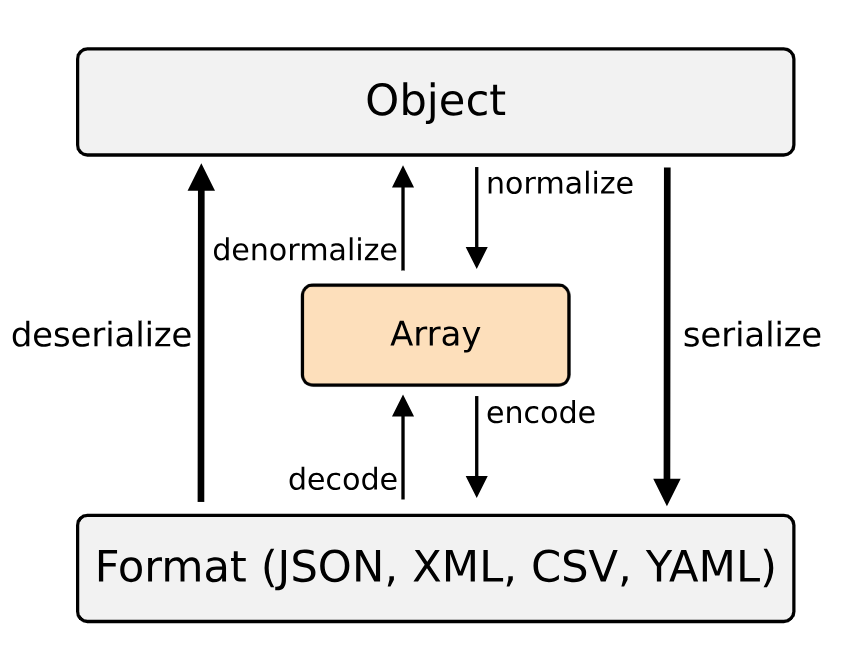
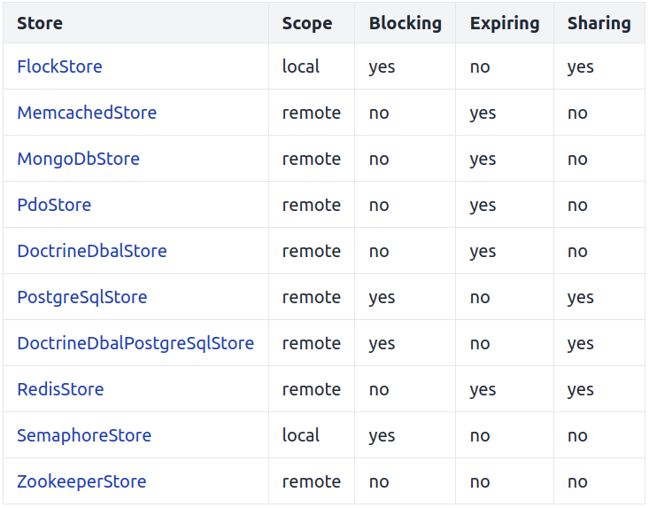

# Miscellaneous

## Configuration (including DotEnv and ExpressionLanguage components)

### DotEnv

To have a look at all the available options run `config:dump-reference`

* Symfony typical project begins with three environments: `dev`, `prod` and `test` and the config files are loaded in this order :
    1. The files in config/packages/*.`<extension>`;
    2. the files in config/packages/`<environment-name>`/*.`<extension>`;
    3. config/services.`<extension>`;
    4. config/services_`<environment-name>`.`<extension>`.
* It's also possible to define options for different env with `when@<environment>` key.
* A command can be run in different env by prefixing it like this :
```console
APP_ENV=prod php bin/console command_name
```
* .env file is read and parsed on every request
* You can access your config parameters from a controller (extending AbstractController) using the getParameter() method or by injecting the ContainerBagInterface inside your service :
```php
// src/Service/MessageGenerator.php
namespace App\Service;

// ...

use Symfony\Component\DependencyInjection\ParameterBag\ContainerBagInterface;

class MessageGenerator
{
    public function __construct(
        private ContainerBagInterface $params,
    ) {
    }

    public function someMethod(): void
    {
        // get any container parameter from $this->params, which stores all of them
        $sender = $this->params->get('mailer_sender');
        // ...
    }
}
```
### ExpressionLanguage

* The ExpressionLanguage component provides an engine that can compile and evaluate expressions. An expression is a one-liner that returns a value (mostly, but not limited to, Booleans).
* Main class is [ExpressionLanguage](https://github.com/symfony/symfony/blob/7.0/src/Symfony/Component/ExpressionLanguage/ExpressionLanguage.php)
```php
use Symfony\Component\ExpressionLanguage\ExpressionLanguage;

$expressionLanguage = new ExpressionLanguage();

var_dump($expressionLanguage->evaluate('1 + 2')); // displays 3

var_dump($expressionLanguage->compile('1 + 2')); // displays (1 + 2)
```
evaluation: the expression is evaluated without being compiled to PHP;<br>
compile: the expression is compiled to PHP, so it can be cached and evaluated.
* Here are some variables and methods provided by Symfony to create expressions :
    - `user`
    An instance of UserInterface that represents the current user or null if you're not authenticated.
    - `role_names`
    An array with the string representation of the roles the user has. This array includes any roles granted indirectly via the role hierarchy but it does not include the IS_AUTHENTICATED_* attributes (see the functions below).
    - `object`
    The object (if any) that's passed as the second argument to isGranted().
    - `subject`
    It stores the same value as object, so they are equivalent.
    - `token`
    The token object.
    - `is_authenticated()`
    - `is_remember_me()`
    - `is_fully_authenticated()`
    - `is_granted()`
```php
// src/Controller/MyController.php
namespace App\Controller;

use Symfony\Bundle\FrameworkBundle\Controller\AbstractController;
use Symfony\Component\ExpressionLanguage\Expression;
use Symfony\Component\HttpFoundation\Response;
use Symfony\Component\Security\Http\Attribute\IsGranted;

class MyController extends AbstractController
{
    #[IsGranted(new Expression('is_granted("ROLE_ADMIN") or is_granted("ROLE_MANAGER")'))]
    public function show(): Response
    {
        // ...
    }

    #[IsGranted(new Expression(
        '"ROLE_ADMIN" in role_names or (is_authenticated() and user.isSuperAdmin())'
    ))]
    public function edit(): Response
    {
        // ...
    }
}
```
## Deployment Best Practices

* Tagging a particular version of your code as a release in your source control repository;
* Creating a temporary staging area to build your updated setup "offline";
* Running any tests available to ensure code and/or server stability;
* Removal of any unnecessary files from the public/ directory to keep your production environment clean;
* Clearing of external cache systems (like Memcached or Redis).
* Use OPcache class preloading
* OPcache best values : 
```shell
; php.ini
; maximum memory that OPcache can use to store compiled PHP files
opcache.memory_consumption=256

; maximum number of files that can be stored in the cache
opcache.max_accelerated_files=20000
opcache.validate_timestamps=0
```
* optimizing composer autoloader by running: 
```console
composer dump-autoload --no-dev --classmap-authoritative
```

## Cache, Process and Serializer components

### Cache component

There are two different approaches provided by this component:<br>
  - **PSR-6 Caching**: A generic cache system, which involves cache "pools" and cache "items".
  - **Cache Contracts**: A simpler yet more powerful way to cache values based on recomputation callbacks.

#### Cache contracts

* supported by all adapters
```php
use Symfony\Contracts\Cache\ItemInterface;
use Symfony\Component\Cache\Adapter\FilesystemAdapter;

$cache = new FilesystemAdapter();

// The callable will only be executed on a cache miss.
$value = $cache->get('my_cache_key', function (ItemInterface $item): string {
    $item->expiresAfter(3600);

    // ... do some HTTP request or heavy computations
    $computedValue = 'foobar';

    return $computedValue;
});

echo $value; // 'foobar'

// ... and to remove the cache key
$cache->delete('my_cache_key');
```

#### PSR-6 Caching

```php
use Symfony\Component\Cache\Adapter\FilesystemAdapter;

$cache = new FilesystemAdapter();

// create a new item by trying to get it from the cache
$productsCount = $cache->getItem('stats.products_count');

// assign a value to the item and save it
$productsCount->set(4711);
$cache->save($productsCount);

// retrieve the cache item
$productsCount = $cache->getItem('stats.products_count');
if (!$productsCount->isHit()) {
    // ... item does not exist in the cache
}
// retrieve the value stored by the item
$total = $productsCount->get();

// remove the cache item
$cache->deleteItem('stats.products_count');
```

A lot of Adapters are provided by this component (Redis, Memcached, PDO, Doctrine etc)

### Process component

The [Process](https://github.com/symfony/symfony/blob/7.0/src/Symfony/Component/Process/Process.php) class executes a command in a sub-process, taking care of the differences between operating system and escaping arguments to prevent security issues. It replaces PHP functions like `exec`, `passthru`, `shell_exec` and `system`. Here is the Process constructor signature:
```php
    /**
     * @param array          $command The command to run and its arguments listed as separate entries
     * @param string|null    $cwd     The working directory or null to use the working dir of the current PHP process
     * @param array|null     $env     The environment variables or null to use the same environment as the current PHP process
     * @param mixed          $input   The input as stream resource, scalar or \Traversable, or null for no input
     * @param int|float|null $timeout The timeout in seconds or null to disable
     *
     * @throws LogicException When proc_open is not installed
     */
    public function __construct(array $command, string $cwd = null, array $env = null, mixed $input = null, ?float $timeout = 60)
```
* `getOutput()` method returns the whole content of the standard output.
* `getErrorOutput()` method returns the whole content of the error output.
* `getIncrementalOutput()` and `getIncrementalErrorOutput()` return content since last call
```php
$process = new Process(['/path/command', '--option', 'argument', 'etc.']);
$process->run();
```
e.g. asynchronously
```php
$process = new Process(['ls', '-lsa']);
$process->start();

// ... do other things

$process->wait();

// ... do things after the process has finished
```
[Advanced use cases in the docs](https://symfony.com/doc/current/components/process.html)

### Serializer component

This is a huge topic so [here is a link to the Seralizer component docs](https://symfony.com/doc/current/components/serializer.html)


deserialization example
```php
use App\Model\Person;

$data = <<<EOF
<person>
    <name>foo</name>
    <age>99</age>
    <sportsperson>false</sportsperson>
</person>
EOF;

$person = $serializer->deserialize($data, Person::class, 'xml');
```
deserialization following example disabling ALLOW_EXTRA_ATTRIBUTES option so as to throw an exception if data contains properties which are not attributes of the targetted class.
```php
use App\Model\Person;

$data = <<<EOF
<person>
    <name>foo</name>
    <age>99</age>
    <city>Paris</city>
</person>
EOF;

// $loader is any of the valid loaders explained later in this article
$classMetadataFactory = new ClassMetadataFactory($loader);
$normalizer = new ObjectNormalizer($classMetadataFactory);
$serializer = new Serializer([$normalizer]);

// this will throw a Symfony\Component\Serializer\Exception\ExtraAttributesException
// because "city" is not an attribute of the Person class
$person = $serializer->deserialize($data, Person::class, 'xml', [
    AbstractNormalizer::ALLOW_EXTRA_ATTRIBUTES => false,
]);
```

## Messenger component

see [this cheat sheet](/sf44-messenger-cheat-sheet.pdf)

**Since Symfony 7, it's not mandatory to implement MessageHandlerInterface in the handler class. Symfony recognize the handler thanks to type-hinting the message class in the __invoke() method of the handler**<br>
E.g. assuming SmsNotification is the message class:
```php
// src/MessageHandler/SmsNotificationHandler.php
namespace App\MessageHandler;

use App\Message\SmsNotification;
use Symfony\Component\Messenger\Attribute\AsMessageHandler;

#[AsMessageHandler]
class SmsNotificationHandler
{
    public function __invoke(SmsNotification $message)
    {
        // ... do some work - like sending an SMS message!
    }
}
```

## Mime and Mailer components

### Mime component

* MIME (Multipurpose Internet Mail Extensions) is an Internet standard that extends the original basic format of emails to support more features like:
    - Headers and text contents using non-ASCII characters;
    - Message bodies with multiple parts (e.g. HTML and plain text contents);
    - Non-text attachments: audio, video, images, PDF, etc.
* Two ways of creating MIME messages :
    - A high-level API based on the [Email](https://github.com/symfony/symfony/blob/7.0/src/Symfony/Component/Mime/Email.php) class to quickly create email messages with all the common features;
    - A low-level API based on the [Message](https://github.com/symfony/symfony/blob/7.0/src/Symfony/Component/Mime/Message.php) class to have absolute control over every single part of the email message.
* The messages created with these two API can be serialized.
* You can guess the MIME type of any given file:
```php
use Symfony\Component\Mime\MimeTypes;

$mimeTypes = new MimeTypes();
$mimeType = $mimeTypes->guessMimeType('/some/path/to/image.gif');
// Guessing is not based on the file name, so $mimeType will be 'image/gif'
// only if the given file is truly a GIF image
```

#### Creating a message with Email class

```php
use Symfony\Component\Mime\Email;

$email = (new Email())
    ->from('fabien@symfony.com')
    ->to('foo@example.com')
    ->cc('bar@example.com')
    ->bcc('baz@example.com')
    ->replyTo('fabien@symfony.com')
    ->priority(Email::PRIORITY_HIGH)
    ->subject('Important Notification')
    ->text('Lorem ipsum...')
    ->html('<h1>Lorem ipsum</h1> <p>...</p>')
;
```

#### Creating a message with the Message class

```php
use Symfony\Component\Mime\Header\Headers;
use Symfony\Component\Mime\Message;
use Symfony\Component\Mime\Part\Multipart\AlternativePart;
use Symfony\Component\Mime\Part\TextPart;

$headers = (new Headers())
    ->addMailboxListHeader('From', ['fabien@symfony.com'])
    ->addMailboxListHeader('To', ['foo@example.com'])
    ->addTextHeader('Subject', 'Important Notification')
;

$textContent = new TextPart('Lorem ipsum...');
$htmlContent = new TextPart('<h1>Lorem ipsum</h1> <p>...</p>', null, 'html');
$body = new AlternativePart($textContent, $htmlContent);

$email = new Message($headers, $body);
```

### Mailer component

* Mailer component is used to send email (and Mime component to create them)
* Three transports out of the box (`smtp`, `sendmail` and `native`)
* To send email, we just need an instance of Mailer type hinted with MailerInterface.
* Emails can be configured globally in mailer.yaml
```yaml
# config/packages/mailer.yaml
framework:
    mailer:
        envelope:
            sender: 'fabien@example.com'
            recipients: ['foo@example.com', 'bar@example.com']
        headers:
            From: 'Fabien <fabien@example.com>'
            Bcc: 'baz@example.com'
            X-Custom-Header: 'foobar'
```
* We ca define email contents with Twig by using [TemplatedEmail](https://github.com/symfony/symfony/blob/7.0/src/Symfony/Bridge/Twig/Mime/TemplatedEmail.php) class
* Emails can be sent asynchronously with Messenger using a [SendEmailMessage](https://github.com/symfony/symfony/blob/7.0/src/Symfony/Component/Mailer/Messenger/SendEmailMessage.php)
* Symfony provides a command to test sending emails `php bin/console mailer:test someone@example.com`

## Finder and FileSystem Component

### Finder 
basic usage : 
```php
use Symfony\Component\Finder\Finder;

$finder = new Finder();
// find all files in the current directory
$finder->files()->in(__DIR__);

// check if there are any search results
if ($finder->hasResults()) {
    // ...
}

foreach ($finder as $file) {
    $absoluteFilePath = $file->getRealPath();
    $fileNameWithExtension = $file->getRelativePathname();

    // ...
}
```

* Finder is an instance of [SplFileInfo](https://github.com/symfony/symfony/blob/7.0/src/Symfony/Component/Finder/SplFileInfo.php) which extends PHP's own [SplFileInfo](https://secure.php.net/manual/en/class.splfileinfo.php)
* Finder object doesn't reset his internal state automatically and must be reinstantiated to get mixed results
* By default finder retrieves files and directories but each has a method (`files()` and `directories()`)
* to define a custom filtering, we can use the `filter()` method :
```php
$filter = function (\SplFileInfo $file)
{
    if (strlen($file) > 10) {
        return false;
    }
};

$finder->files()->filter($filter);
```
* a sorter algorithm can be defined with the `sort()` method
* contents of returned files can be read using the `getContents()` method
[Full doc](https://symfony.com/doc/current/components/finder.html)

### FileSystem Component

This component has two main classes : [Filesystem](https://github.com/symfony/symfony/blob/7.0/src/Symfony/Component/Filesystem/Filesystem.php) and [Path](https://github.com/symfony/symfony/blob/7.0/src/Symfony/Component/Filesystem/Path.php)

#### Filesystem

* provides several methods to manage files (mkdir(), touch(), chmod(), chown(), copy(), mirror() etc) [full list](https://symfony.com/doc/current/components/filesystem.html#filesystem-utilities)
* `dumpFile()` saves a given content into a file (and creates file/directory if it does not exist)

#### Path

This class offers utilities dealing with paths.

* `canonicalize()` deals with the difference between paths on different OS
* Path provides static methods to convert absolute to relative paths (makeAbsolute, isRelative etc)
* find the basePath or check the longest common path using (`getLongestCommonBasePath()`)
* `getDirectory()` method replaces PHP's own `dirname()` which has several issues 
* `getRoot()` returns the root of a path

## Lock component

Locks are created using a LockFactory class, which in turn requires another class to manage the storage of locks
```php
use Symfony\Component\Lock\LockFactory;
use Symfony\Component\Lock\Store\SemaphoreStore;

$store = new SemaphoreStore();
$factory = new LockFactory($store);
```
The lock is created by calling the createLock() method. Its first argument is an arbitrary string that represents the locked resource. Then, a call to the acquire() method will try to acquire the lock:
```php
// ...
$lock = $factory->createLock('pdf-creation');

if ($lock->acquire()) {
    // The resource "pdf-creation" is locked.
    // You can compute and generate the invoice safely here.

    $lock->release();
}
```
* `acquire()` method returns `false` immediately if the lock can't be acquired.
* By passing `true` as the argument for the `acquire()` method, you'll wait indefinitely until the lock could be acquired (blocking mode).
* You can manage expiration of the lock<br>
`$lock = $factory->createLock('pdf-creation', ttl: 30);`

### Shared Locks

A shared or readers-writer lock is a synchronization primitive that allows concurrent access for read-only operations, while write operations require exclusive access. This means that multiple threads can read the data in parallel but an exclusive lock is needed for writing or modifying data.
* Use the `acquireRead()` method to acquire a read-only lock

Here are some Stores available in the component (implementing [PersistingStoreInterface](https://github.com/symfony/symfony/blob/7.0/src/Symfony/Component/Lock/PersistingStoreInterface.php))


## Web Profiler, Web Debug Toolbar and Data collectors

### Profiler

* Can be accessed programmatically
```php
// ... $profiler is the 'profiler' service
$profile = $profiler->loadProfileFromResponse($response);
```
or thanks to the value of the `X-Debug-Token` header
```php
$token = $response->headers->get('X-Debug-Token');
$profile = $profiler->loadProfile($token);
```
* provides a `find()` method to fid token based on some criteria:
```php
public function find(?string $ip, ?string $url, ?int $limit, ?string $method, ?string $start, ?string $end, string $statusCode = null, \Closure $filter = null): array
```
* can be enabled or diasbled with the `enable()` and `disable()` methods from the Profiler service. An alias has to be created to inject this service in our controllers :
```yaml
# config/services_dev.yaml
services:
    Symfony\Component\HttpKernel\Profiler\Profiler: '@profiler'
```
* Can also be enabled conditionally:
```yaml
# config/packages/dev/web_profiler.yaml
    framework:
        profiler:
            collect: false
            # If the request includes a query parameter 'profile' (or any string defined here), profiler will be enabled
            collect_parameter: 'profile' 
```
* By default, the debug toolbar does not refresh after each AJAX request. But you can force that behaviour : `$response->headers->set('Symfony-Debug-Toolbar-Replace', '1');`

### Data Collector

* Data collectors are classes (tagged with 'data_collector') that get informations about the request. You can list them by running:
```console
php bin/console debug:container --tag=data_collector
```
* To create a custom one, implement DataCollectorInterface or extends AbstractDataCollector and use the `collect()` (stores collected data in the $data property), `reset()`, `getName()` (collector identifier, by default the FQCN of the data collector class) or `getTemplate()` (to add a web profiler template) methods.

## Internationalization and localization (and Intl component)

* Translations can be organized into groups (called **domains**). By default trnaslations use the default `messages` domain.<br> 
`echo $translator->trans('Hello World', domain: 'messages');`
* The filename of the translation files is also important: each message file must be named according to the following path: domain.locale.loader (e.g. messages.fr.yaml)
```yaml
# translations/messages.fr.yaml
Symfony is great: J'aime Symfony
```
* You can also use a [TranslatableMessage](https://github.com/symfony/symfony/blob/7.0/src/Symfony/Component/Translation/TranslatableMessage.php)
```php
use Symfony\Component\Translation\TranslatableMessage;

// the first argument is required and it's the original message
$message = new TranslatableMessage('Symfony is great!');
// the optional second argument defines the translation parameters and
// the optional third argument is the translation domain
$status = new TranslatableMessage('order.status', ['%status%' => $order->getStatus()], 'store');
```
* The Intl component provides access to the localization data of the ICU (International Components for Unicode) library :
    - Language and Script Names
    - Country Names
    - Locales
    - Currencies
    - Timezones
    - Emoji Transliteration

## Runtime component

* The Runtime component abstracts most bootstrapping logic as so-called runtimes, allowing you to write front-controllers in a generic way.
```php
// public/index.php
use App\Kernel;

require_once dirname(__DIR__).'/vendor/autoload_runtime.php';

return function (array $context): Kernel {
    return new Kernel($context['APP_ENV'], (bool) $context['APP_DEBUG']);
};
```
Here how it works :
  1. It instantiates a RuntimeInterface;
  2. The callable (returned by public/index.php) is passed to the Runtime, whose job is to resolve the arguments (in this example: array $context);
  3. Then, this callable is called to get the application (App\Kernel);
  4. At last, the Runtime is used to run the application (i.e. calling $kernel->handle(Request::createFromGlobals())->send()).
* Default Runtime is [SymfonyRuntime](https://github.com/symfony/symfony/blob/7.0/src/Symfony/Component/Runtime/SymfonyRuntime.php) (works well with app running with a webserver using php-fpm). The component also provides a [GenericRuntime](https://github.com/symfony/symfony/blob/7.0/src/Symfony/Component/Runtime/GenericRuntime.php) (which uses some PHP's superglobals - $_SERVER, $_POST, $_GET, $_FILES and $_SESSION). And it's possible to create your own custom Runtime.
* You can specify the runtime you use with the `APP_RUNTIME` or with the extra.runtime.class option in composer.json
* Here are the arguments supported by the SymfonyRuntime :
    - `Request`
    A request created from globals.
    - `InputInterface`
    An input to read options and arguments.
    - `OutputInterface`
    Console output to print to the CLI with style.
    - `Application`
    An application for creating CLI applications.
    - `Command`
    For creating one line command CLI applications (using `Command::setCode()`).
* Supported by both SymfonyRuntime and GenericRuntime :
    - `array $context`
    This is the same as `$_SERVER` + `$_ENV`.
    - `array $argv`
    The arguments passed to the command (same as `$_SERVER['argv']`).
    - `array $request`
    With keys query, body, files and session.

## Clock component

The Clock component decouples applications from the system clock. This allows you to fix time to improve testability of time-sensitive logic. It provides a ClockInterface with the following implementations:
    - [NativeClock](https://github.com/symfony/symfony/blob/7.0/src/Symfony/Component/Clock/NativeClock.php):
    Provides a way to interact with the system clock, this is the same as doing new \DateTimeImmutable().
    - [MockClock](https://github.com/symfony/symfony/blob/7.0/src/Symfony/Component/Clock/MockClock.php):
    Commonly used in tests as a replacement for the NativeClock to be able to freeze and change the current time using either sleep() or modify().
    - [MonotonicClock](https://github.com/symfony/symfony/blob/7.0/src/Symfony/Component/Clock/MonotonicClock.php)
    Relies on hrtime() and provides a high resolution, monotonic clock, when you need a precise stopwatch.
```php
use Symfony\Component\Clock\Clock;
use Symfony\Component\Clock\MockClock;

// by default, Clock uses the NativeClock implementation, but you can change
// this by setting any other implementation
Clock::set(new MockClock());

// Then, you can get the clock instance
$clock = Clock::get();

// Additionally, you can set a timezone
$clock->withTimeZone('Europe/Paris');

// From here, you can get the current time
$now = $clock->now();

// And sleep for any number of seconds
$clock->sleep(2.5);
```
* now() method returns a DatePoint class (small wrapper on top of PHP's DateTimeImmutable, usable everywhere a DateTimeImmutable or DateTimeInterface is expected)
* The component provides two traits :
    - [ClockAwareTrait](https://github.com/symfony/symfony/blob/7.0/src/Symfony/Component/Clock/ClockAwareTrait.php): has to be used in our services so as to test them using MockClock.
    - [ClockSensitiveTrait](https://github.com/symfony/symfony/blob/7.0/src/Symfony/Component/Clock/Test/ClockSensitiveTrait.php): helpful to write time-sensitive test (provides methods to freeze time and restore global clock after each test).
```php
  namespace App\Tests\TimeUtils;

use App\TimeUtils\MonthSensitive;
use PHPUnit\Framework\TestCase;
use Symfony\Component\Clock\Test\ClockSensitiveTrait;

class MonthSensitiveTest extends TestCase
{
    use ClockSensitiveTrait;

    public function testIsWinterMonth(): void
    {
        $clock = static::mockTime(new \DateTimeImmutable('2022-03-02'));

        $monthSensitive = new MonthSensitive();
        $monthSensitive->setClock($clock);

        $this->assertTrue($monthSensitive->isWinterMonth());
    }

    public function testIsNotWinterMonth(): void
    {
        $clock = static::mockTime(new \DateTimeImmutable('2023-06-02'));

        $monthSensitive = new MonthSensitive();
        $monthSensitive->setClock($clock);

        $this->assertFalse($monthSensitive->isWinterMonth());
    }
}
```